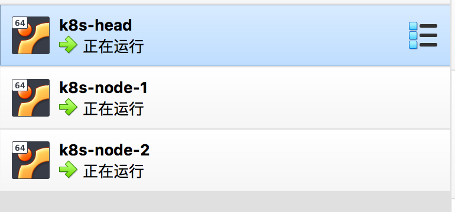
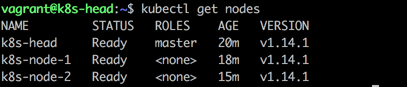
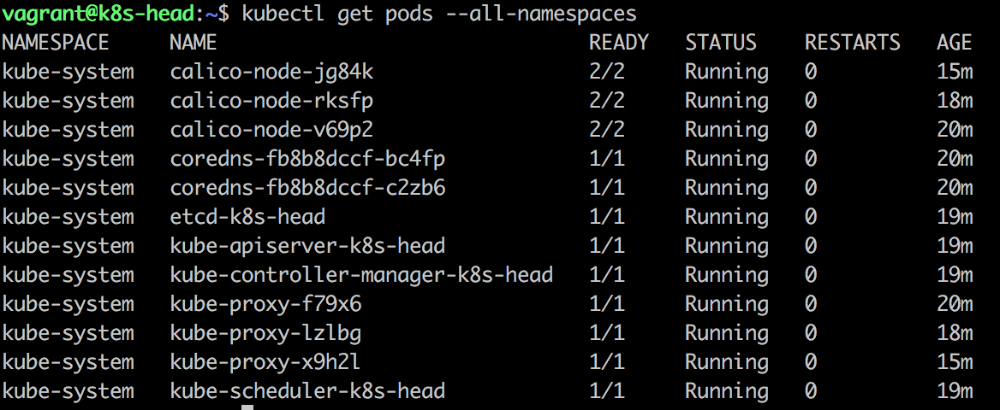

# 使用
结合Virtualbox和Vagrant可以快速在本地搭建一个三个节点的k8s集群，可以方便用于本地调研等。

配置中的所有资源地址都尽可能使用了aliyun镜像，保证安装速度。

先下载 https://github.com/htynkn/k8s-vagrant-in-china/archive/master.zip

在解压后的目录中执行
```
vagrant up
```

# 启动效果






